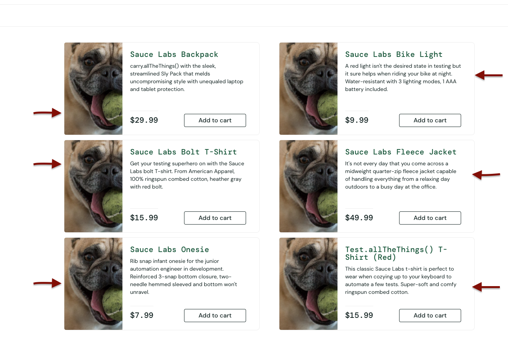
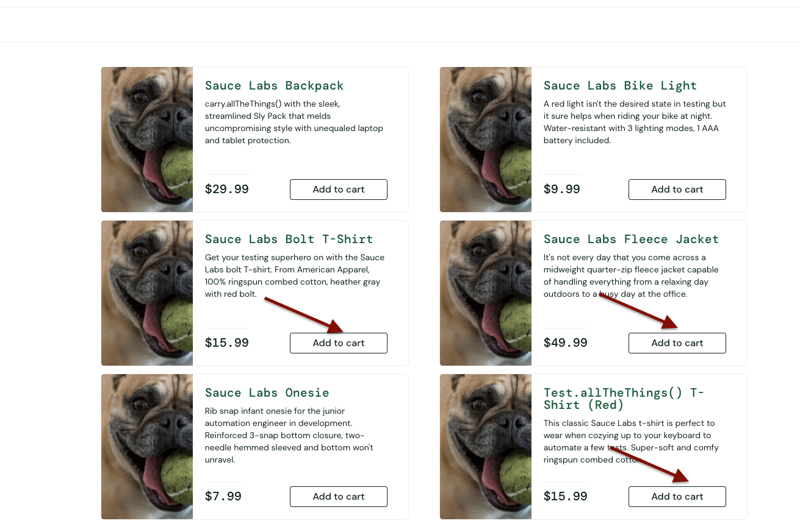
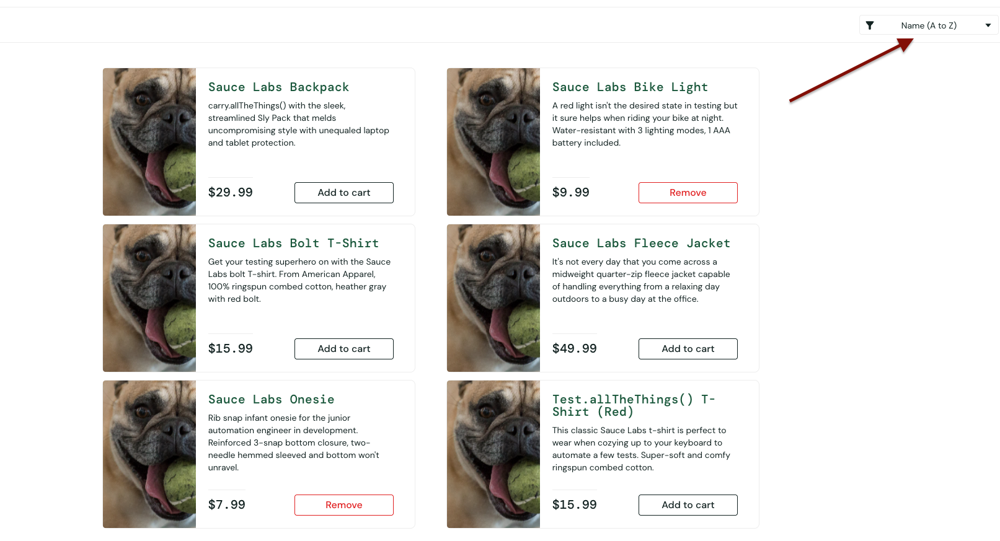

# BEON QA Automation Challenge

## Prerequisites

- **Node.js** >= 18
- **npm** >= 9

## Installation

```bash
git clone https://github.com/andres-barrera06/beon-qa-automation-challenge.git
cd beon-qa-automation-challenge
npm install
npx playwright install chromium
```

## Running Tests

| Command | Description |
|---|---|
| `npm test` | Run all tests |
| `npm run test:ui` | UI tests only (headless) |
| `npm run test:api` | API tests only |
| `npm run test:ui:headed` | UI tests with visible browser |
| `npm run test:headed` | All tests with visible browser |
| `npm run test:debug` | Debug mode with Playwright Inspector |
| `npm run report` | Open HTML report |
| `npm run lint` | Run ESLint |
| `npm run lint:fix` | Run ESLint with auto-fix |

### Run a specific test file

```bash
npx playwright test tests/ui/checkout.spec.ts
npx playwright test tests/api/booking.spec.ts
```

## Framework Architecture

```
src/
├── config/
│   └── env.config.ts              # Centralized URLs per environment
├── models/
│   ├── booking.model.ts           # TypeScript interfaces for API entities
│   └── user.model.ts              # Credentials, CheckoutInfo types
├── data/
│   ├── users.data.ts              # Test data for UI and API users
│   └── bookings.data.ts           # Booking payloads (create, update)
├── selectors/                     # Locator definitions (separated from pages)
│   ├── login.selectors.ts
│   ├── inventory.selectors.ts
│   ├── cart.selectors.ts
│   └── checkout.selectors.ts
├── pages/                         # Page Object Model (UI interactions)
│   ├── base.page.ts
│   ├── login.page.ts
│   ├── inventory.page.ts
│   ├── cart.page.ts
│   └── checkout.page.ts
├── api/                           # API Client Layer
│   ├── base.client.ts
│   ├── auth.client.ts
│   └── booking.client.ts
├── steps/                         # Business flow steps with test.step()
│   ├── login.steps.ts
│   ├── inventory.steps.ts
│   ├── cart.steps.ts
│   ├── checkout.steps.ts
│   └── booking.steps.ts
└── fixtures/
    ├── ui.fixture.ts              # Injects page objects into UI tests
    └── api.fixture.ts             # Injects API clients into API tests
tests/
├── ui/
│   └── checkout.spec.ts           # E2E purchase flow on SauceDemo
└── api/
    └── booking.spec.ts            # Full booking lifecycle (CRUD)
```

## Design Principles

### Layered Architecture: Selectors -> Pages -> Steps -> Tests

Each layer has a single responsibility, following the **Single Responsibility Principle (SRP)** from SOLID:

**Selectors** define *where* the elements are. All locators use resilient `data-test` attributes, centralized in one place per page. If the UI changes a selector, you update one file.

```ts
// src/selectors/login.selectors.ts
export const LoginSelectors = {
  usernameInput: '[data-test="username"]',
  passwordInput: '[data-test="password"]',
  loginButton: '[data-test="login-button"]',
} as const;
```

**Pages** define *how* to interact with elements. They only contain actions: `click()`, `fill()`, `locator()`. They import selectors but have no business logic.

```ts
// src/pages/login.page.ts
async login(credentials: Credentials) {
  await this.page.locator(LoginSelectors.usernameInput).fill(credentials.username);
  await this.page.locator(LoginSelectors.passwordInput).fill(credentials.password);
  await this.page.locator(LoginSelectors.loginButton).click();
}
```

**Steps** define *what* business flow to execute. They wrap page calls inside `test.step()` for readable HTML reports and reusable flows.

```ts
// src/steps/login.steps.ts
async loginWithCredentials(credentials: Credentials) {
  await test.step(`Login with user "${credentials.username}"`, async () => {
    await this.loginPage.login(credentials);
  });
}
```

**Tests** define *which* scenario to validate. They only orchestrate steps — no direct page interactions, no selectors, no low-level actions.

```ts
// tests/ui/checkout.spec.ts
await loginSteps.navigateToLogin();
await loginSteps.loginWithCredentials(users.standard);
await inventorySteps.addItemsToCart([0, 1]);
await checkoutSteps.verifyOrderSuccess();
```

### Abstract Base Classes (DRY)

`BasePage` and `BaseClient` provide shared functionality so child classes only define their specific behavior:

- **BasePage**: common helpers like `waitForPageLoad()` and `screenshot()`
- **BaseClient**: typed HTTP methods (`get`, `post`, `put`, `delete`) with base URL and headers preconfigured

### Playwright Fixtures (Dependency Injection)

Custom fixtures handle creation and cleanup of page objects and API clients automatically. Tests receive them as parameters — no manual instantiation, no cleanup boilerplate. API clients also auto-dispose their request contexts after each test.

### Typed Models & Separated Data

TypeScript interfaces enforce the shape of API payloads and responses. Test data lives in dedicated files (`users.data.ts`, `bookings.data.ts`), using camelCase naming convention consistently across the project.

### Resilient Locators

All selectors use `data-test` attributes instead of brittle CSS classes or XPath. This makes tests stable against UI changes that don't affect functionality.

## CI Pipeline

GitHub Actions runs automatically on every push to `main` and on pull requests:

```
lint ──────┐
           ├──> test-api  (artifact: api-test-report)
type-check ┤
           └──> test-ui   (artifact: ui-test-report)
```

| Job | Description |
|---|---|
| **ESLint** | Static analysis with `typescript-eslint` |
| **TypeScript** | Type checking with `tsc --noEmit` |
| **API Tests** | Booking lifecycle tests, uploads HTML report |
| **UI Smoke Tests** | E2E purchase flow, uploads HTML report |

Test reports are uploaded as artifacts on every run (even on failure) with 14-day retention. Download them from the Actions tab.

## Test Reporting

The HTML report shows each test with collapsible steps for clear debugging:

```
E2E Purchase Flow
  ├── Navigate to login page
  ├── Login with user "standard_user"
  ├── Add 2 items to cart
  ├── Navigate to shopping cart
  ├── Validate cart has 2 items
  ├── Proceed to checkout
  ├── Fill checkout information
  ├── Complete the order
  └── Verify order confirmation message
```

View the report locally after running tests:

```bash
npm run report
```

---

## Manual QA Bug Report — SauceDemo (`problem_user`)

Exploratory testing was performed manually on [SauceDemo](https://www.saucedemo.com/) using the `problem_user` / `secret_sauce` credentials. **6 bugs** were identified across the purchase flow.

| ID | Title | Area | Severity |
|---|---|---|---|
| [BUG-001](#bug-001--all-product-images-are-incorrect) | All product images are incorrect | Inventory / UI | High |
| [BUG-002](#bug-002--add-to-cart-button-does-not-work-for-some-products) | Add to cart button does not work for some products | Shopping Cart | High |
| [BUG-003](#bug-003--sorting-options-do-not-work) | Sorting options do not work | Inventory / Filters | Medium |
| [BUG-004](#bug-004--remove-button-does-not-remove-items-from-the-cart) | Remove button does not remove items from the cart | Shopping Cart | High |
| [BUG-005](#bug-005--checkout-form--firstname-field-takes-the-value-of-lastname) | Checkout form — firstName field takes the value of lastName | Checkout / Form | High |
| [BUG-006](#bug-006--product-detail-page-shows-the-wrong-item) | Product detail page shows the wrong item | Inventory / Product Detail | High |

---

### BUG-001 — All product images are incorrect

**Key details**

| | |
|---|---|
| **ID** | BUG-001 |
| **Severity** | High |
| **Area** | Inventory / UI |
| **Status** | Open |

**Description**

All products on the inventory page display the same placeholder image (a dog) instead of their actual product image. No product has the correct image assigned.

**Precondition**

User is logged in as `problem_user`.

**Steps to Reproduce**

1. Navigate to the inventory page.
2. Observe the image displayed for any product.
3. Compare the image against the product name and description.

**Actual Result**

Every product shows the same placeholder image regardless of the product.

**Expected Result**

Each product should display its own corresponding image.

**Additional Information**



---

### BUG-002 — Add to cart button does not work for some products

**Key details**

| | |
|---|---|
| **ID** | BUG-002 |
| **Severity** | High |
| **Area** | Shopping Cart |
| **Status** | Open |

**Description**

The `Add to cart` button does not respond for **Bolt T-Shirt**, **Fleece Jacket**, and **T-Shirt (Red)**. The cart is not updated and the button does not change state.

**Precondition**

User is logged in as `problem_user` and is on the inventory page.

**Steps to Reproduce**

1. Click `Add to cart` on the **Bolt T-Shirt** product.
2. Observe that the button does not change and the cart badge does not increment.
3. Repeat with **Fleece Jacket** and **T-Shirt (Red)**.

**Actual Result**

The click produces no visible action. Only **Solo Backpack**, **Bike Light**, and **Onesie** work correctly.

**Expected Result**

The product should be added to the cart, the badge should increment, and the button should change to `Remove`.

**Additional Information**



---

### BUG-003 — Sorting options do not work

**Key details**

| | |
|---|---|
| **ID** | BUG-003 |
| **Severity** | Medium |
| **Area** | Inventory / Filters |
| **Status** | Open |

**Description**

The sorting options `Z-A` and `Price Low-High` do not change the order of the products. The list remains in the default order regardless of the selection.

**Precondition**

User is logged in as `problem_user` and is on the inventory page.

**Steps to Reproduce**

1. Select `Name (Z to A)` from the sorting dropdown.
2. Observe that the product order does not change.
3. Repeat with `Price (low to high)`.

**Actual Result**

The product order does not change when selecting `Z-A` or `Price Low-High`. Only the default order (`A-Z`) works.

**Expected Result**

Products should be reordered according to the selected criterion.

**Additional Information**



---

### BUG-004 — Remove button does not remove items from the cart

**Key details**

| | |
|---|---|
| **ID** | BUG-004 |
| **Severity** | High |
| **Area** | Shopping Cart |
| **Status** | Open |

**Description**

The `Remove` buttons on the inventory page can be clicked, but products are not removed from the cart. The cart badge count does not decrease.

**Precondition**

User is logged in as `problem_user` with one or more products already added to the cart.

**Steps to Reproduce**

1. Click the `Remove` button on a product in the inventory page.
2. Observe the cart badge count.
3. Open the cart and verify that the product is still there.

**Actual Result**

The button responds visually to the click, but the item remains in the cart and the badge count does not change.

**Expected Result**

The product should be removed from the cart and the badge should decrement.

**Additional Information**

<video src="docs/screenshots/bug_4.mov" controls width="800"></video>

[Download video — bug_4.mov](docs/screenshots/bug_4.mov)

---

### BUG-005 — Checkout form — firstName field takes the value of lastName

**Key details**

| | |
|---|---|
| **ID** | BUG-005 |
| **Severity** | High |
| **Area** | Checkout / Form |
| **Status** | Open |

**Description**

When filling in the checkout form, the `firstName` field displays the value entered in `lastName`, and the `lastName` field is left empty. Values shift between fields, triggering a validation error.

**Precondition**

User is logged in as `problem_user` with at least one product in the cart.

**Steps to Reproduce**

1. Proceed to checkout.
2. Enter `Test` in the **First Name** field.
3. Enter `User` in the **Last Name** field.
4. Click `Continue`.
5. Observe the validation error.

**Actual Result**

**First Name** shows `User` and **Last Name** is left empty, triggering the error: `Last Name is required`.

**Expected Result**

**First Name** should display `Test` and **Last Name** should display `User`.

**Additional Information**

<video src="docs/screenshots/bug_6.mov" controls width="800"></video>

[Download video — bug_6.mov](docs/screenshots/bug_6.mov)

---

### BUG-006 — Product detail page shows the wrong item

**Key details**

| | |
|---|---|
| **ID** | BUG-006 |
| **Severity** | High |
| **Area** | Inventory / Product Detail |
| **Status** | Open |

**Description**

Clicking on any product to view its detail opens a page that belongs to a different product. Detail page links are incorrectly mapped.

**Precondition**

User is logged in as `problem_user` and is on the inventory page.

**Steps to Reproduce**

1. Click on the **Sauce Labs Backpack** product.
2. Observe which product is shown on the detail page.

**Actual Result**

The detail page for **Sauce Labs Fleece Jacket** is shown instead. Each product leads to a different product's detail page.

**Expected Result**

The detail page should display information for **Sauce Labs Backpack**.

**Additional Information**

<video src="docs/screenshots/bug_5.mov" controls width="800"></video>

[Download video — bug_5.mov](docs/screenshots/bug_5.mov)
